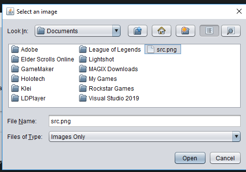
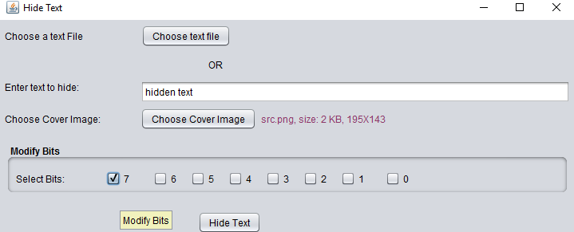
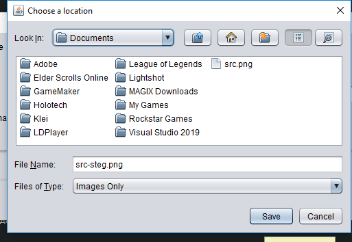
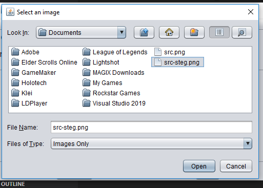
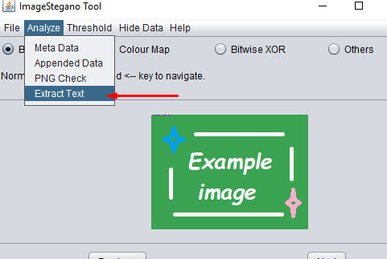
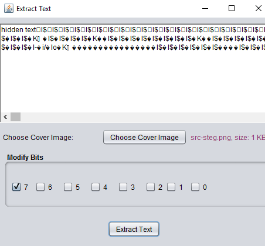

# Вступ до стігонографії
## Мета

Дослідити можливість «приховування» даних у зображеннях

## Автор
Роботу виконав Недашківський Денис група КИТ-н120б

## Індивідуальне завдання

 * Навести реалізацію технології Rar-Jpeg, та продемонструвати її роботу.
 * Виконати скриття даних у зображення за допомогою методу найменьш значимих бітів (Less Significant Bits)
 * Виконати аналіз скриття даних за допомогою методу стегоаналізу "атака хі квадрат"

## Додаткове завдання (опціональне, на додаткові бали)

 * Виконати аналіз скриття даних за допомогою RS методу стегоаналізу 

## Виконання роботы

1. ### Вибiр та вiдкриття файлу: 
   
2. ### Додання секретного текску "hidden text": 
   
3. ### Збереження файлу с модифiкованимми данними: 
   
4. ### Вибiр та вiдкриття файлу с модифiкованимми данними: 
   
5. ### Пошук схованого тексту у фалi с модифiкованимми данними: 
   
6. ### Результат пошуку: 
   
